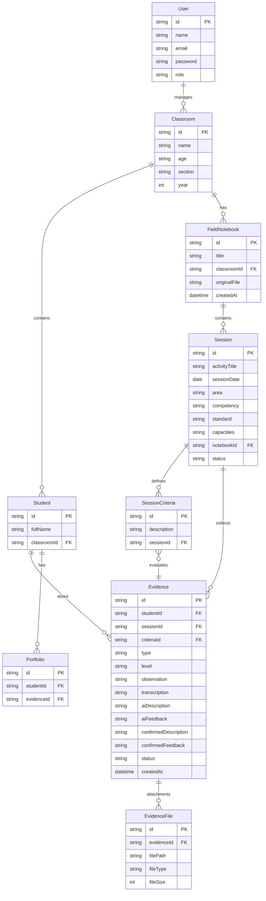

# 🎓 DIGITAL HUB — Sistema de Evaluación y Seguimiento para Educación Inicial

Sistema web responsive para captura de evidencias pedagógicas con asistencia de IA (GPT-4o mini).

## Resumen del Proyecto

Plataforma web responsive que permite a docentes de Educación Inicial:
- **Preparar sesiones** cargando su cuaderno de campo (archivo Word)
- **Capturar evidencias rápidamente** (audio, foto, video, texto) durante la clase desde celular
- **Procesar con IA** (transcripción, descripción de evidencia, retroalimentación) usando GPT-4o mini
- **Gestionar portafolios** individuales por estudiante
- **Generar reportes** semanales/por periodo con IA
- **Dar seguimiento** al progreso individual y por aula

---

## User Review Required

> [!IMPORTANT]
> **Credenciales necesarias**: Deberás configurar tu propia API Key de OpenAI (GPT-4o mini + Whisper) en el archivo `.env.local`. El plan incluye un espacio claro para esto.

> [!IMPORTANT]
> **Google Drive**: La integración con Google Drive requiere credenciales de Google Cloud Console (OAuth 2.0). Se incluirá la configuración pero necesitarás crear un proyecto en Google Cloud Console.

> [!WARNING]
> **Almacenamiento de archivos**: Para el prototipo, los archivos (fotos, videos, audios) se guardarán localmente en el servidor. En producción se recomienda migrar a un servicio de almacenamiento en la nube (S3, Cloud Storage, etc.).

---

## Open Questions

> [!IMPORTANT]
> **Base de datos**: Propongo usar **SQLite con Prisma** para el prototipo (fácil de configurar, sin servidor externo). ¿Prefieres PostgreSQL u otra base de datos?

> [!IMPORTANT]
> **Autenticación**: Propongo usar **NextAuth.js** con credenciales (usuario/contraseña). ¿Necesitas también login con Google?

> [!IMPORTANT]
> **Idioma del código**: La interfaz será 100% en español. ¿Prefieres que el código (variables, funciones, comentarios) esté en inglés o español?

---

## Arquitectura Técnica

### Stack Tecnológico

| Componente | Tecnología | Razón |
|---|---|---|
| **Framework** | Next.js 14 (App Router) | Full-stack, SSR, API Routes, Server Actions |
| **Base de datos** | SQLite + Prisma ORM | Ligera, sin servidor externo, fácil despliegue |
| **Autenticación** | NextAuth.js | Gestión de sesiones segura |
| **IA - Chat** | OpenAI GPT-4o mini | Generación de evidencias, reportes, retroalimentación |
| **IA - Audio** | OpenAI Whisper | Transcripción de audios |
| **Carga de Word** | mammoth.js | Parseo de archivos .docx |
| **Exportación PDF** | jsPDF + html2canvas | Generación de reportes exportables |
| **Estilos** | CSS Vanilla (variables CSS) | Control total, responsive, sin dependencias |
| **Grabación audio** | MediaRecorder API | Nativo del navegador |
| **Cámara** | MediaDevices API | Captura de foto/video nativa |

### Estrategia de IA (Optimización de Tokens)

```
┌─────────────────────────────────────────────────────┐
│                  FLUJO DE IA                         │
├─────────────────────────────────────────────────────┤
│ 1. Audio → Whisper (transcripción)                  │
│ 2. Transcripción + datos mínimos → GPT-4o mini      │
│    - Solo: estudiante, actividad, competencia,       │
│      criterio, nivel, observación                    │
│ 3. GPT-4o mini → Descripción (60 palabras máx)      │
│                → Retroalimentación (40 palabras máx) │
│ 4. Docente revisa y confirma                         │
│ 5. Se guarda en BD (sin enviar historial a IA)       │
└─────────────────────────────────────────────────────┘
```

### Modelo de Datos (Prisma Schema)



---

## Proposed Changes

### Componente 1: Configuración del Proyecto

#### [NEW] Proyecto Next.js completo

Se creará el proyecto Next.js con la siguiente estructura:

```
DIGITAL HUB/
├── .env.local                    # ← CREDENCIALES AQUÍ
├── prisma/
│   └── schema.prisma             # Modelo de datos completo
├── public/
│   └── uploads/                  # Archivos subidos (audios, fotos, videos)
├── src/
│   ├── app/
│   │   ├── layout.js             # Layout principal con sidebar
│   │   ├── page.js               # Dashboard principal
│   │   ├── globals.css           # Sistema de diseño completo
│   │   ├── login/
│   │   │   └── page.js           # Pantalla de login
│   │   ├── api/
│   │   │   ├── auth/[...nextauth]/route.js  # Autenticación
│   │   │   ├── ai/
│   │   │   │   ├── transcribe/route.js      # Whisper transcripción
│   │   │   │   ├── generate-evidence/route.js # GPT-4o mini evidencia
│   │   │   │   └── generate-report/route.js   # GPT-4o mini reportes
│   │   │   ├── classrooms/route.js
│   │   │   ├── students/route.js
│   │   │   ├── sessions/route.js
│   │   │   ├── evidence/route.js
│   │   │   ├── upload/route.js              # Subida de archivos
│   │   │   ├── notebooks/route.js           # Cuaderno de campo
│   │   │   └── reports/route.js
│   │   ├── aulas/
│   │   │   ├── page.js            # Gestión de aulas
│   │   │   └── [id]/
│   │   │       ├── page.js        # Detalle de aula
│   │   │       └── estudiantes/
│   │   │           └── page.js    # Estudiantes del aula
│   │   ├── cuaderno/
│   │   │   ├── page.js            # Lista de cuadernos de campo
│   │   │   └── [id]/
│   │   │       └── page.js        # Detalle del cuaderno
│   │   ├── sesion/
│   │   │   ├── page.js            # Sesiones
│   │   │   └── [id]/
│   │   │       ├── page.js        # Sesión activa (captura rápida)
│   │   │       └── evidencias/
│   │   │           └── page.js    # Evidencias de la sesión
│   │   ├── portafolio/
│   │   │   ├── page.js            # Portafolios por aula
│   │   │   └── [studentId]/
│   │   │       └── page.js        # Portafolio individual
│   │   ├── seguimiento/
│   │   │   └── page.js            # Seguimiento y progreso
│   │   ├── reportes/
│   │   │   └── page.js            # Generación de reportes
│   │   └── revisiones/
│   │       └── page.js            # Panel de revisión de evidencias
│   ├── components/
│   │   ├── Sidebar.js             # Navegación lateral (laptop)
│   │   ├── MobileNav.js           # Navegación inferior (celular)
│   │   ├── AudioRecorder.js       # Grabadora de audio
│   │   ├── CameraCapture.js       # Captura de foto/video
│   │   ├── EvidenceCard.js        # Tarjeta de evidencia
│   │   ├── StudentCard.js         # Tarjeta de estudiante
│   │   ├── QuickCapture.js        # Panel de captura rápida
│   │   ├── LevelSelector.js       # Selector de nivel de logro
│   │   ├── AIReviewModal.js       # Modal para revisar sugerencias IA
│   │   ├── ProgressChart.js       # Gráfico de progreso
│   │   ├── AlertBanner.js         # Alertas pedagógicas
│   │   ├── FileUploader.js        # Cargador de archivos Word
│   │   └── ReportGenerator.js     # Generador de reportes
│   └── lib/
│       ├── prisma.js              # Cliente Prisma singleton
│       ├── auth.js                # Configuración NextAuth
│       ├── openai.js              # Cliente OpenAI + prompts
│       └── utils.js               # Utilidades generales
├── package.json
└── next.config.js
```

---

### Componente 2: Sistema de Diseño (CSS)

#### [NEW] [globals.css](file:///c:/Users/maryo/OneDrive/Escritorio/TRABAJOS_UPAO/DIGITAL%20HUB/src/app/globals.css)

Sistema de diseño premium con:
- **Paleta de colores** profesional educativa (tonos cálidos + acentos vibrantes)
- **Modo oscuro** automático
- **Glassmorphism** sutil en tarjetas y modales
- **Variables CSS** para consistencia total
- **Responsive breakpoints**: Mobile-first (320px → 768px → 1024px → 1440px)
- **Micro-animaciones**: transiciones suaves, hover effects, loading states
- **Tipografía**: Google Fonts (Inter + Outfit)

---

### Componente 3: Autenticación

#### [NEW] Login y gestión de sesión
- Pantalla de login con diseño premium
- NextAuth.js con CredentialsProvider
- Sesiones JWT para rendimiento
- Protección de rutas server-side

---

### Componente 4: Gestión de Aulas y Estudiantes

#### [NEW] CRUD de aulas y estudiantes
- Crear/editar/eliminar aulas (nombre, sección, edad)
- Registrar estudiantes por aula
- Interfaz tipo cards con búsqueda

---

### Componente 5: Cuaderno de Campo

#### [NEW] Carga y gestión de cuadernos de campo
- **Carga de archivo Word (.docx)** usando mammoth.js
- Parseo automático de la estructura del cuaderno:
  - Título de actividad
  - Fecha, Aula, Edad, Área
  - Competencia, Estándar, Capacidades
  - Criterios de evaluación
- Creación manual como alternativa
- Organización: Aula → Cuaderno → Sesiones

---

### Componente 6: Sesión Activa y Captura Rápida

#### [NEW] Pantalla de sesión activa (optimizada para celular)
- Vista principal mostrando: sesión del día, lista de niños
- **4 botones de captura rápida**:
  - 🎙️ Grabar audio (MediaRecorder API)
  - 📷 Tomar foto (MediaDevices API)
  - 🎥 Grabar video corto
  - ✏️ Evidencia escrita rápida
- **Selector de nivel de logro**: Inicio / Proceso / Logrado / Requiere apoyo
- Selección rápida de estudiante
- Asociación automática a la sesión activa

---

### Componente 7: Procesamiento con IA

#### [NEW] API Routes para IA

**Transcripción (Whisper)**:
```
POST /api/ai/transcribe
Body: FormData con archivo de audio
→ Devuelve: texto transcrito
```

**Generación de evidencia (GPT-4o mini)**:
```
POST /api/ai/generate-evidence
Body: { estudiante, actividad, competencia, criterio, nivel, observacion }
→ Devuelve: { descripcion (60 palabras), retroalimentacion (40 palabras) }
```

**Generación de reporte (GPT-4o mini)**:
```
POST /api/ai/generate-report
Body: { estudiante, evidencias_confirmadas[] }
→ Devuelve: reporte estructurado
```

**Prompt optimizado para ahorro de tokens**:
```
Eres asistente pedagógico para Educación Inicial.
Con base en la observación, genera:
1. Descripción de evidencia: máximo 60 palabras.
2. Aspectos a retroalimentar: máximo 40 palabras.
No inventes datos. Usa lenguaje docente claro.

Datos:
Estudiante: {nombre}
Actividad: {actividad}
Competencia: {competencia}
Criterio: {criterio}
Nivel observado: {nivel}
Observación: {observacion}
```

---

### Componente 8: Portafolio Individual

#### [NEW] Portafolio por estudiante
- Historial de evidencias por estudiante
- Filtros por sesión, competencia, fecha
- Vista de archivos adjuntos (fotos, videos, audios)
- Nivel observado y retroalimentación por evidencia

---

### Componente 9: Panel de Revisión

#### [NEW] Panel de revisión de evidencias
- Lista de evidencias con estados: pendiente, revisada, confirmada, corregida
- Edición de transcripción, nivel, descripción, retroalimentación
- Cambio de estudiante asociado
- Filtros por sesión, estudiante, estado, tipo
- Indicadores de evidencias pendientes

---

### Componente 10: Seguimiento y Progreso

#### [NEW] Dashboard de seguimiento
- Progreso individual por competencia y criterio
- Conteo de evidencias por estudiante
- Comparación de niveles entre sesiones
- Identificación de estudiantes sin evidencias recientes
- Patrones recurrentes

---

### Componente 11: Reportes y Alertas

#### [NEW] Generación de reportes
- Reportes semanales y por periodo
- Reporte individual por estudiante
- Reporte por aula (vista general)
- Generación con IA basada en evidencias confirmadas
- Exportación a PDF
- **Alertas pedagógicas**:
  - Estudiantes sin evidencia reciente
  - Criterios poco evaluados
  - Dificultades recurrentes
  - Sugerencias de observación

---

### Componente 12: Configuración de Credenciales

#### [NEW] [.env.local](file:///c:/Users/maryo/OneDrive/Escritorio/TRABAJOS_UPAO/DIGITAL%20HUB/.env.local)

```env
# ============================================
# CREDENCIALES - CONFIGURAR ANTES DE USAR
# ============================================

# OpenAI API Key (para GPT-4o mini y Whisper)
# Obtener en: https://platform.openai.com/api-keys
OPENAI_API_KEY=sk-XXXXXXXXXXXXXXXXXXXXXXXXX

# NextAuth Secret (generar con: openssl rand -base64 32)
NEXTAUTH_SECRET=tu-secreto-aqui-generar-uno-aleatorio
NEXTAUTH_URL=http://localhost:3000

# Google Drive API (opcional - para respaldo)
# Crear en: https://console.cloud.google.com/
GOOGLE_CLIENT_ID=tu-client-id.apps.googleusercontent.com
GOOGLE_CLIENT_SECRET=tu-client-secret

# Base de datos (SQLite por defecto)
DATABASE_URL="file:./dev.db"
```

---

## Verificación del Plan

### Automated Tests
```bash
# Verificar que el proyecto compila correctamente
npm run build

# Verificar que el servidor de desarrollo funciona
npm run dev

# Verificar la base de datos
npx prisma db push
npx prisma studio
```

### Manual Verification
1. Login con credenciales de prueba
2. Crear aula y registrar estudiantes
3. Subir cuaderno de campo (archivo Word)
4. Crear sesión y probar captura rápida desde celular
5. Grabar audio y verificar transcripción con Whisper
6. Verificar generación de evidencia con GPT-4o mini
7. Revisar y confirmar evidencias desde laptop
8. Verificar portafolio individual
9. Generar reporte con IA
10. Verificar alertas pedagógicas
11. Exportar reporte a PDF

---

## Estimación de Desarrollo

| Fase | Componentes | Prioridad |
|---|---|---|
| **Fase 1** | Config + BD + Auth + CSS + Layout | 🔴 Crítica |
| **Fase 2** | Aulas + Estudiantes + Cuaderno de campo | 🔴 Crítica |
| **Fase 3** | Sesión activa + Captura rápida | 🔴 Crítica |
| **Fase 4** | IA (Transcripción + Evidencia + Retroalimentación) | 🔴 Crítica |
| **Fase 5** | Portafolio + Revisión | 🟡 Alta |
| **Fase 6** | Seguimiento + Reportes + Alertas | 🟡 Alta |
| **Fase 7** | Exportación PDF + Google Drive | 🟢 Media |
